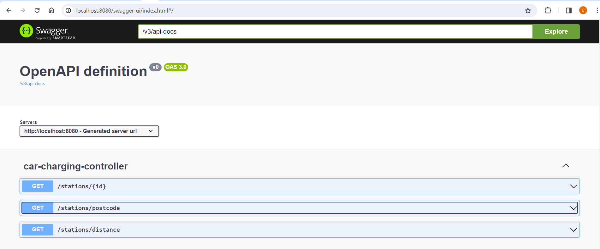

**Spring Boot REST API for finding electric car charging station**

The charging station can be search by Unique ID, Zipcode/Postalcode and Geolocation(latitude/longitude) within given radius/distance in km 

TECHNOLOGY:

Java JDK 17 / Apache-maven-3.9.5 / Spring Boot (version 3.2.3)
IDE IntelliJ Idea Ultimate - JetBrains

HOW TO START
1. Clone the repository:git clone https://github.com/hlnet1/chargingstation.git
2. Maven clean/install to run the tests and build the project
3. The application can be run by executable jar ChargingStation-0.0.1-SNAPSHOT.jar with command line and/or using IDE (IntelijJ, Eclipse, STS)
4. The service run on server port 8080: http://localhost:8080/swagger-ui/index.html#
5. Three API endpoints are documented by use of Swagger

5.1 GET stations/postcode: test zipcodes: 22017/22016 >> provides list of stations by zipcode
5.2 GET stations/distance: test data latitude:49.278011 longitude: 2.092911 radius > 4km
5.3 GET stations/id: copy UUID from any of the responses for 5.1/5.2

Service logic and implementation details:
An in-memory database (H2) is used to store the test data persisted with sql script. 
Implementation is based on OOP incl SOLID principles: Single entity "Station" integrated with JPA/Hibernate, DAO JPA repository "StationRepository" as a data store, CarChargingService interface and CarChargingServiceImpl and CarChargingController for RESTful web service logic using the default JSON format. Additionally StationDTO is deployed though in this simple case it's a trade-off between good practice and DRY principle 
Custom exception ObjectNotFoundException is used for status NOT_FOUND 404 that is handled by the controller class.
The functionality is covered by Dev conceptual tests. The components are tested by unit tests and a plain WebMockMvc test for Rest Controller.TestConstant-s are stored in util package

